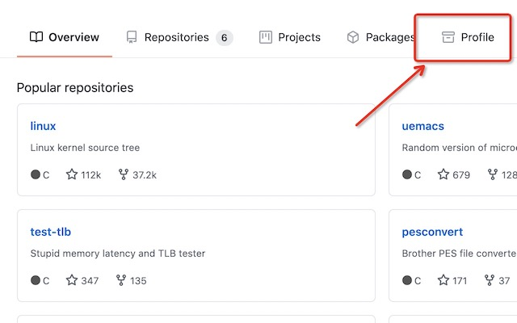
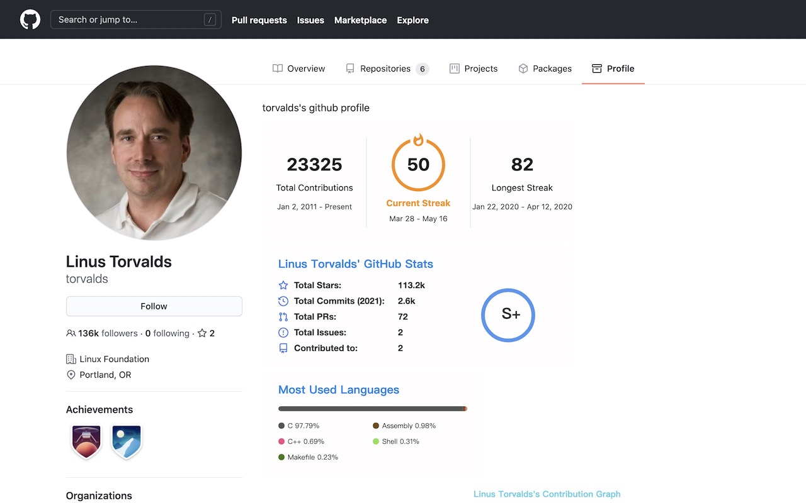

# github-profile
Its a fun profile tab for Github with Chrome extensions

## Screenshots

## Usage

Just install it from chrome extension store.

[Chrome Extension Store](https://chrome.google.com/webstore/detail/github-profile/eijnkinhnplaekpllmgbbfieecdhcmcp)

## Thanks

- [awesome-github-profile-readme](https://github.com/abhisheknaiidu/awesome-github-profile-readme)
